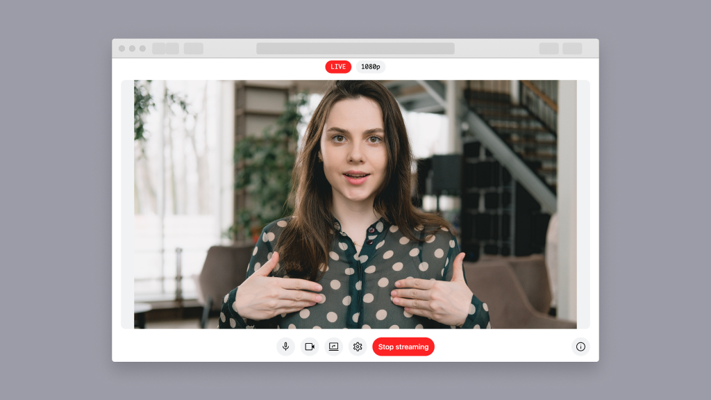

# Amazon IVS Broadcast Web Demo

A demo web application intended as an educational tool to demonstrate how you can build a browser-based streaming tool with the [Amazon IVS Web Broadcast SDK](https://aws.github.io/amazon-ivs-web-broadcast/docs/sdk-guides/introduction).

**Demo:** Visit [https://stream.ivs.rocks/](https://stream.ivs.rocks/) and add your channel's `ingest endpoint` and `stream key` on the settings screen.



**This project is intended for education purposes only and not for production usage.**

## Prerequisites

- [NodeJS](https://nodejs.org/)
- [Yarn](https://yarnpkg.com/getting-started/install) package manager
- Your IVS Channel details. A guide is available here: [Getting started with Amazon IVS](https://docs.aws.amazon.com/ivs/latest/userguide/getting-started.html).

## Running the demo

Follow these instructions to run the demo:

1. Run: `yarn install`
2. Run: `yarn run dev`

## Customizing the demo

To customize this demo, [fork it](https://docs.github.com/en/get-started/quickstart/fork-a-repo#forking-a-repository) and modify the source code to suit your needs.

### Change color theme

To modify the colors used in the application UI, modify the colors defined in [tailwind.config.js](./tailwind.config.js).

### Change layouts

To modify the available layouts or add your own, modify the contents of [BroadcastLayoutTemplates.js](./utils/BroadcastLayoutTemplates.js). Math expressions within strings are supported and include the following variables:

```
CANVAS_WIDTH // the width of the canvas
CANVAS_HEIGHT // the height of the canvas
LAYER_WIDTH // the width of the current layer
LAYER_HEIGHT // the height of the current layer
```

## Known issues and limitations

- The application is meant for demonstration purposes and **not** for production use.
- This application is only tested and supported on the latest Desktop versions of Chrome and Firefox. Other browsers and devices, including mobile browsers and smartphones, may work with this tool, but are not officially supported at this time.

## About Amazon IVS

Amazon Interactive Video Service (Amazon IVS) is a managed live streaming and stream chat solution that is quick and easy to set up, and ideal for creating interactive video experiences. [Learn more](https://aws.amazon.com/ivs/).

- [Amazon IVS docs](https://docs.aws.amazon.com/ivs/)
- [User Guide](https://docs.aws.amazon.com/ivs/latest/userguide/)
- [API Reference](https://docs.aws.amazon.com/ivs/latest/APIReference/)
- [Setting Up for Streaming with Amazon Interactive Video Service](https://aws.amazon.com/blogs/media/setting-up-for-streaming-with-amazon-ivs/)
- [Learn more about Amazon IVS on IVS.rocks](https://ivs.rocks/)
- [View more demos like this](https://ivs.rocks/examples)

## Security

See [CONTRIBUTING](https://github.com/aws-samples/amazon-ivs-broadcast-web-demo/blob/main/CONTRIBUTING.md#security-issue-notifications) for more information.

## License

This library is licensed under the MIT-0 License.
